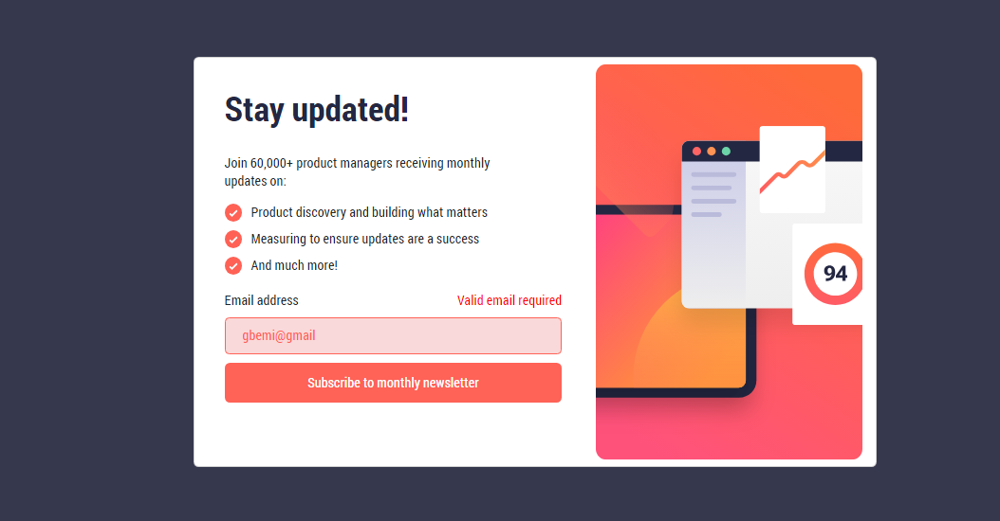
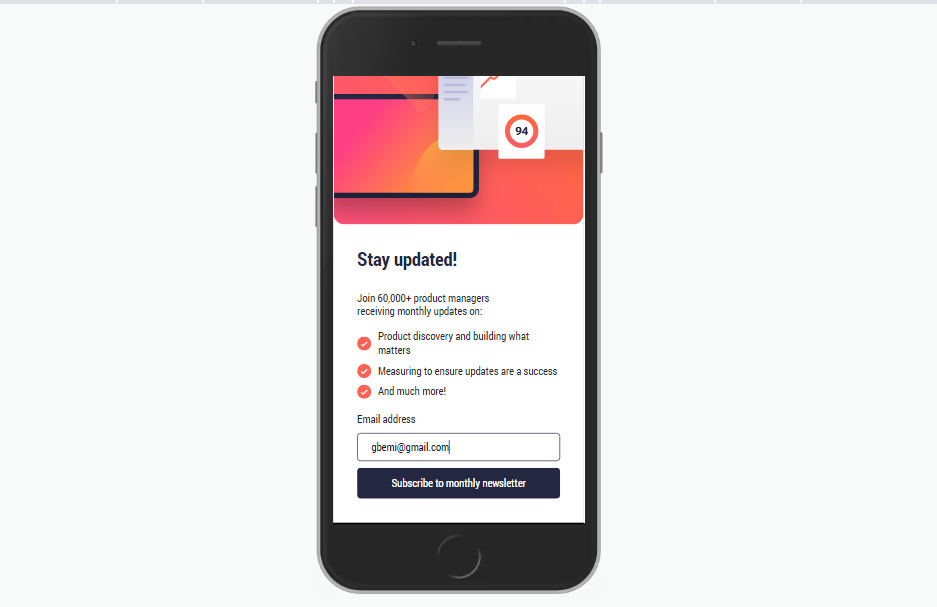
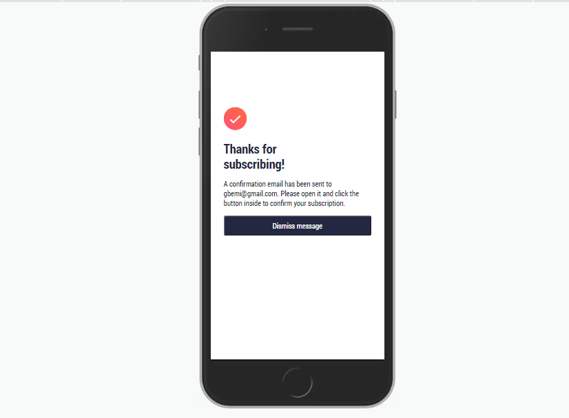

# Frontend Mentor - Newsletter sign-up form with success message solution

This is a solution to the [Newsletter sign-up form with success message challenge on Frontend Mentor](https://www.frontendmentor.io/challenges/newsletter-signup-form-with-success-message-3FC1AZbNrv). Frontend Mentor challenges help you improve your coding skills by building realistic projects. 

## Table of contents
  - [Screenshot](#screenshot)
  - [Links](#links)
- [My process](#my-process)
  - [Built with](#built-with)
  - [What I learned](#what-i-learned)
- [Author](#author)

### Screenshot

**Desktop view**

**Mobile view before submission**

**Mobile view before submission**

### Links

- Live Site URL: [Add live site URL here](https://your-live-site-url.com)

## My process

### Built with

- Semantic HTML5 markup
- CSS custom properties
- Flexbox
- BootStrap 5

### What I learned

This project enlighted me to surf and learn more about form especially in the validation area.

## Author

- Frontend Mentor - [@yG-best007](https://www.frontendmentor.io/profile/G-best007)
- Twitter - [@yG-best007](https://www.twitter.com/g_best007)

